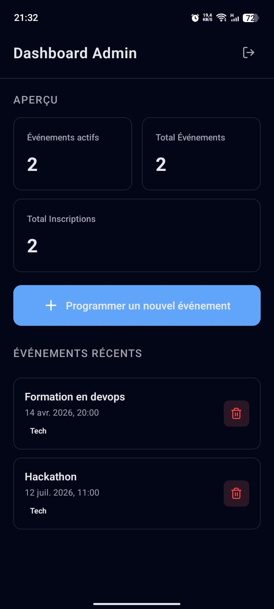
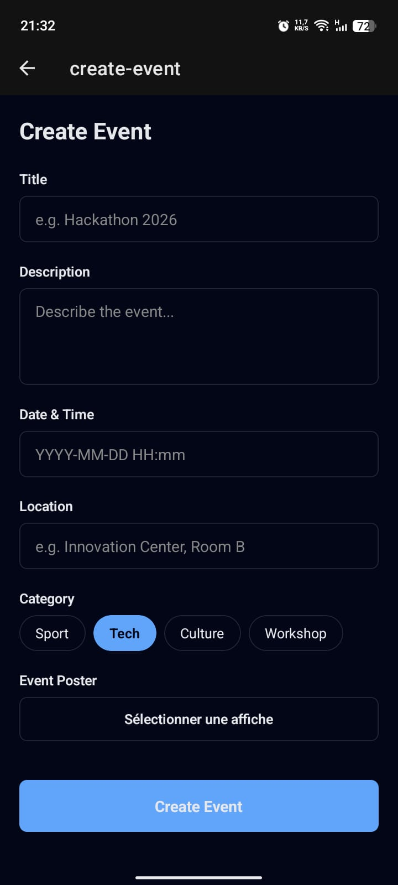
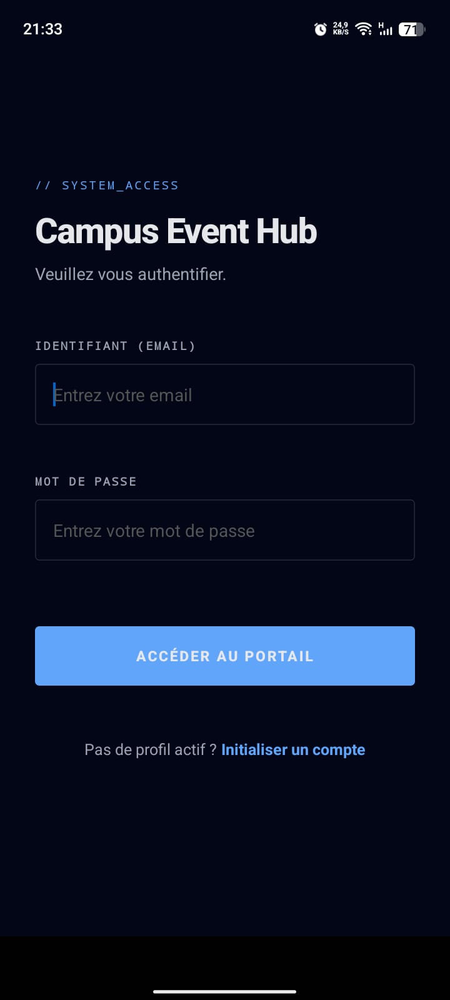
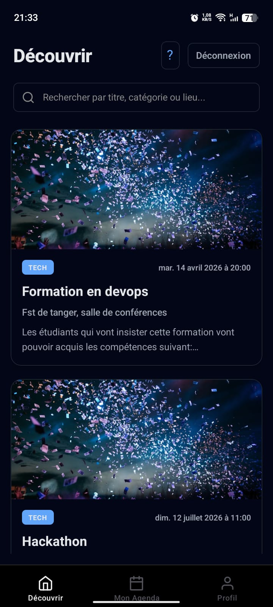
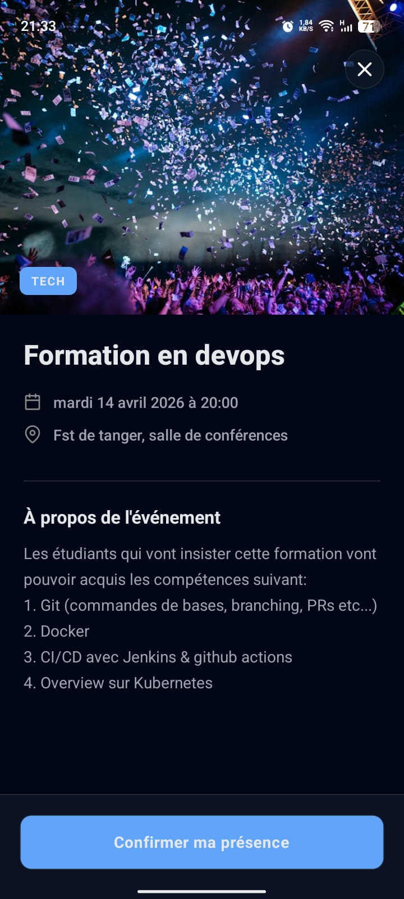
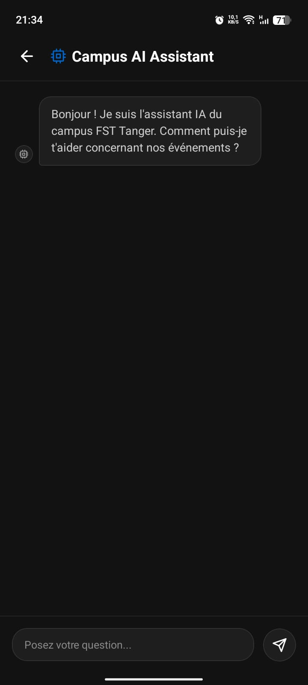

# CampusPulse — Orchestration d'Événements Académiques & Architecture Distribuée

[](https://expo.dev)
[](https://reactnative.dev)
[](https://supabase.com)
[](https://www.typescriptlang.org)
[](https://deepmind.google/technologies/gemini/)
[](https://zod.dev)

> **CampusPulse** est une plateforme d'ingénierie mobile conçue pour centraliser, sécuriser et dynamiser le cycle de vie des événements académiques. Ce projet transcende le simple cadre universitaire pour proposer une architecture logicielle *Production-Ready*, intégrant l'intelligence artificielle (RAG) et des standards de sécurité de niveau industriel.

---

## 📑 Table des Matières

1. [Vision et Mission du Projet](#-vision-et-mission-du-projet)
2. [Visual Experience (Product Tour)](#-visual-experience-product-tour)
3. [Philosophie d'Architecture](#-philosophie-darchitecture)
4. [Stack Technique & Choix d'Ingénierie](#-stack-technique--choix-dingénierie)
5. [Fonctionnalités Core & RAG IA](#-fonctionnalités-core--rag-ia)
6. [Gouvernance des Données & Sécurité](#-gouvernance-des-données--sécurité)
7. [Design System : ThinkPad Neo-Brutalism](#-design-system--thinkpad-neo-brutalism)
8. [Workflow d'Installation](#-workflow-dinstallation)
9. [Roadmap & Évolutions](#-roadmap--évolutions)
10. [Auteur](#-auteur)

---

## 🎯 Vision et Mission du Projet

Dans les Facultés des Sciences et Techniques (FST), la fragmentation de l'information est un anti-pattern chronique : les événements, hackathons et séminaires sont dispersés sur de multiples canaux non structurés (groupes WhatsApp, affichages physiques, emails noyés). 

**Le problème :** L'absence d'une source de vérité unique (Single Source of Truth) entraîne une déperdition d'engagement étudiant et une charge opérationnelle lourde pour les administrateurs et les clubs.

**La solution CampusPulse :** Une application mobile centralisée, réactive et intelligente. En couplant un backend Serverless (Supabase) à une interface déclarative ultra-fluide (React Native / Reanimated) et un moteur de traitement du langage naturel (Gemini 3 Flash), CampusPulse offre :
* **Pour l'étudiant :** Une découverte asynchrone, un suivi personnalisé et une assistance IA disponible 24/7.
* **Pour l'administration :** Un tableau de bord de pilotage avec télémétrie en temps réel de l'engagement.

---

## 🖼️ Visual Experience (Product Tour)

L'interface a été conçue sans compromis sur l'ergonomie, en respectant une hiérarchie visuelle stricte pour minimiser la charge cognitive de l'utilisateur.

### 🔐 Espace Administrateur : Gouvernance & Télémétrie
| **Admin Dashboard** | **Event Orchestration** | **User Management** |
| :--- | :--- | :--- |
|  |  |  |
| *Moteur de statistiques (KPIs) en temps réel avec data-viz minimaliste.* | *Interface CRUD avancée avec validation schématique Zod en temps réel.* | *Contrôle des accès (RBAC), élévation de privilèges et modération.* |

### 🎓 Espace Étudiant : Engagement & Découverte
| **Event Feed** | **Event Details** | **AI Assistant (RAG)** |
| :--- | :--- | :--- |
|  |  |  |
| *Flux asynchrone optimisé avec Skeleton Loaders.* | *Système d'inscription State-Driven avec micro-interactions.* | *Assistant IA injecté par RAG, contexte spécifique à la FST.* |

---

## 🏗️ Philosophie d'Architecture

Le projet rejette l'approche monolithique au profit d'une **Clean Architecture** modulaire, orchestrée via le File-Based Routing d'Expo. Cette séparation des préoccupations (Separation of Concerns) garantit une scalabilité horizontale.

### 1. Unified Auth Strategy & Guarding (Context Layer)
Le "Cœur" de l'application est un `AuthContext` imperméable.
* **Aiguillage Topologique :** Le routeur évalue dynamiquement le JWT (JSON Web Token) et le claim de rôle (`admin` vs `student`) pour router l'utilisateur vers son segment (`/(tabs)` ou `/(admin)`). Les accès non autorisés sont bloqués avant même le montage du composant.
* **Session Persistence :** Les sessions sont cryptées et stockées via `expo-secure-store`, survivant aux redémarrages de l'application sans fuite de mémoire.

### 2. Service Layer (Data Abstraction)
Le code UI ne parle *jamais* directement à la base de données.
* **Repository Pattern :** Les appels Supabase (Auth, Events, Stats) sont encapsulés dans des classes de services (`event-service.ts`, `ai-service.ts`). Cela rend le backend théoriquement interchangeable.
* **Optimistic UI Updates :** Grâce à **TanStack Query (React Query)**, les mutations (comme "Rejoindre un événement") mettent à jour le cache local instantanément, avant même la confirmation du serveur, garantissant une latence perçue de 0ms.

---

## 🛠️ Stack Technique & Choix d'Ingénierie

La stack n'a pas été choisie par commodité, mais pour sa capacité à délivrer des performances natives tout en gardant une agilité de développement maximale.

### Frontend (Presentation)
* **React Native & Expo SDK 54** : Framework de base garantissant une compilation JIT (Just-In-Time) optimisée et un accès unifié aux APIs natives iOS/Android.
* **Expo Router (v3)** : Navigation par système de fichiers, apportant le typage statique des routes et le support natif des Deep Links.
* **React Native Reanimated (v3)** : Déportation des calculs d'animation sur le thread UI natif (via Worklets C++), évitant tout drop de framerate sur le thread JS (garanti 60 FPS).
* **TanStack Query** : Orchestration des requêtes asynchrones, invalidation de cache intelligente et gestion du *polling*.

### Backend & AI (Infrastructure)
* **Supabase (PostgreSQL)** : Backend-as-a-Service Open Source. Fournit une base relationnelle robuste, des abonnements Real-Time via WebSockets, et une gestion identitaire intégrée.
* **Google Gemini 3 Flash** : LLM sélectionné spécifiquement pour son *Time-To-First-Token* (TTFT) extrêmement bas, idéal pour une expérience de chat mobile.
* **Zod** : Validation de schémas "Schema-First" en TypeScript pour assainir les payloads avant toute transaction réseau.

---

## 🚀 Fonctionnalités Core & RAG IA (Deep Dive)

### 🤖 Campus AI : Architecture RAG (Retrieval-Augmented Generation)
L'application n'utilise pas l'IA comme un simple gadget de chat, mais comme un agent contextuel.
1.  **Vecteur de Contexte :** Lors de l'ouverture du chat, l'application effectue un fetch silencieux des événements à venir via le Service Layer.
2.  **Prompt Injection :** Ce JSON de données est sérialisé et injecté dans le `SystemPrompt` de Gemini.
3.  **Résultat :** L'assistant devient omniscient concernant le campus. Il ne produit pas d'hallucinations car il est "grounded" (ancré) exclusivement sur la base de données de la FST.

### 🔔 Engine de Notifications Locales
Pour maximiser la rétention sans infrastructure complexe de Push Notifications.
* **Calcul Déterministe :** Lors de l'inscription à un événement, l'algorithme calcule le `TimeDelta` et programme un Trigger via le Thread natif de l'OS (Android AlarmManager / iOS UNUserNotificationCenter) exactement 1 heure avant le début.
* **Garbage Collection :** Désinscription = Annulation immédiate du token de rappel local.

---

## 🛡️ Gouvernance des Données & Sécurité

En tant qu'application "Ready-World", la sécurité n'est pas une option.

* **Row Level Security (RLS) :** La sécurité est implémentée au niveau de la base de données PostgreSQL. Un utilisateur avec un JWT `role: student` ne peut techniquement pas exécuter un `INSERT` sur la table `events`, même s'il parvient à forger une requête API depuis Postman.
* **Strict TypeScript :** Élimination de 90% des erreurs au runtime grâce à un typage de bout en bout (End-to-End Type Safety), de la définition des tables Supabase jusqu'aux props des composants React.
* **Graceful Degradation :** Implémentation d'Error Boundaries. Si le service IA ou Supabase tombe, l'UI ne crash pas (White Screen of Death), mais affiche un état de repli (Fallback UI) élégant.

---

## 🎨 Design System : "ThinkPad Neo-Brutalism"

Le design rompt avec les interfaces surchargées et enfantines pour s'adresser à un public d'ingénieurs.

* **Palette "Absolute Dark" :** Utilisation d'un fond pur `#000000` (optimisation batterie OLED), de cartes `#121212` (Zinc) et d'accents bleus techniques (`#0066CC`).
* **Feedback Haptique & Visuel :** Tous les composants interactifs héritent de la classe `AnimatedPressable`, calculant un effet de ressort (Spring Damping) qui donne du "poids" numérique aux actions de l'utilisateur.
* **Skeletons Dynamiques :** Le chargement asynchrone est masqué par des géométries qui pulsent doucement, réduisant le taux de rebond lié à l'attente réseau.

---

## ⚙️ Workflow d'Installation (Developer Guide)

Pour instancier ce projet sur un environnement de développement local :

### Prérequis
* Node.js (v18+)
* Gestionnaire de paquets : `npm` ou `yarn`
* Compte Supabase (Projet actif) & API Key Google AI Studio (Gemini)
* Application Expo Go installée sur votre terminal mobile (Android/iOS)

### Étapes de déploiement

1.  **Clonage du Dépôt** :
    ```bash
    git clone [https://github.com/yassinekamouss/CampusEventHub.git](https://github.com/yassinekamouss/CampusEventHub.git)
    cd CampusEventHub
    ```

2.  **Configuration des Variables d'Environnement** :
    Créer un fichier `.env` à la racine stricte du projet. L'utilisation du préfixe `EXPO_PUBLIC_` est obligatoire pour l'injection au moment du build.
    ```env
    EXPO_PUBLIC_SUPABASE_URL=https://[VOTRE_PROJET].supabase.co
    EXPO_PUBLIC_SUPABASE_ANON_KEY=[VOTRE_CLE_ANON]
    EXPO_PUBLIC_GEMINI_API_KEY=[VOTRE_CLE_GEMINI]
    ```

3.  **Installation des Dépendances (Clean Install)** :
    ```bash
    npm cache clean --force
    rm -rf node_modules package-lock.json
    npm install
    ```

4.  **Démarrage du Bundler Metro** :
    ```bash
    npx expo start -c
    ```
    *Le flag `-c` assure une purge du cache de transformation pour garantir la prise en compte des variables `.env`.*

---

## 🗺️ Roadmap & Évolutions

Bien que le MVP (Minimum Viable Product) soit pleinement opérationnel, l'architecture a été pensée pour absorber les évolutions suivantes :

* **[v1.1] Scan QR Code Entrée :** Intégration de `expo-camera` pour permettre aux admins de valider la présence des étudiants via QR Code à l'entrée des salles.
* **[v1.2] Export Analytics :** Génération de rapports PDF de présence à la volée pour l'administration de la FST.
* **[v2.0] Backend Microservices :** Migration conditionnelle de la logique Supabase vers une grappe de microservices Spring Boot / EKS si le scale universitaire l'exige.

---

## 👨‍💻 Auteur

**Yassine Kamouss**
*Élève Ingénieur en Ingénierie Logicielle et Systèmes Intelligents (LSI)*
**Faculté des Sciences et Techniques (FST) de Tanger**

* Full-Stack Developer (MERN / React Native)
* Cloud & DevOps Integrator
* Architecte de Systèmes RAG / IA

[](https://www.linkedin.com/in/yassinekamouss) [](https://github.com/yassinekamouss)

---

> *"Dans le développement logiciel moderne, la complexité doit toujours résider dans l'architecture, jamais dans l'expérience utilisateur. Un bon code est celui qui se fait oublier."*